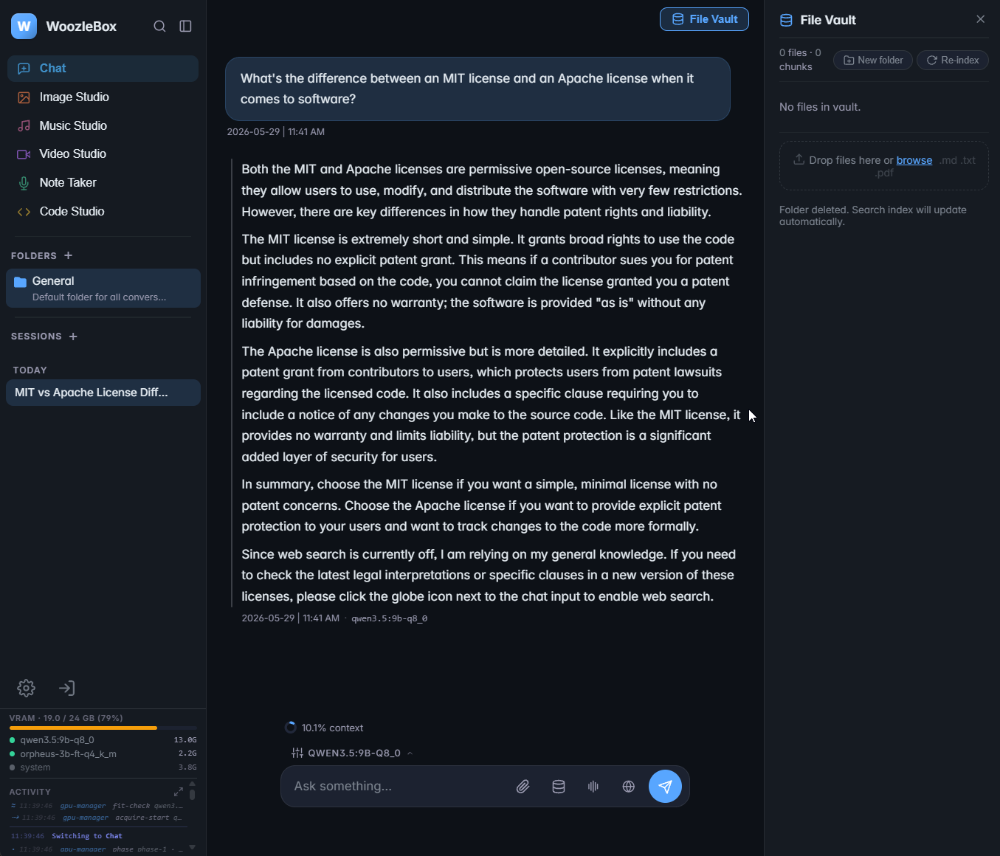
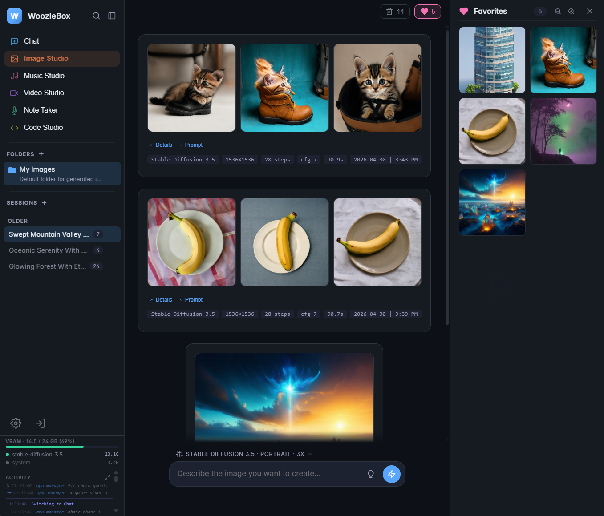
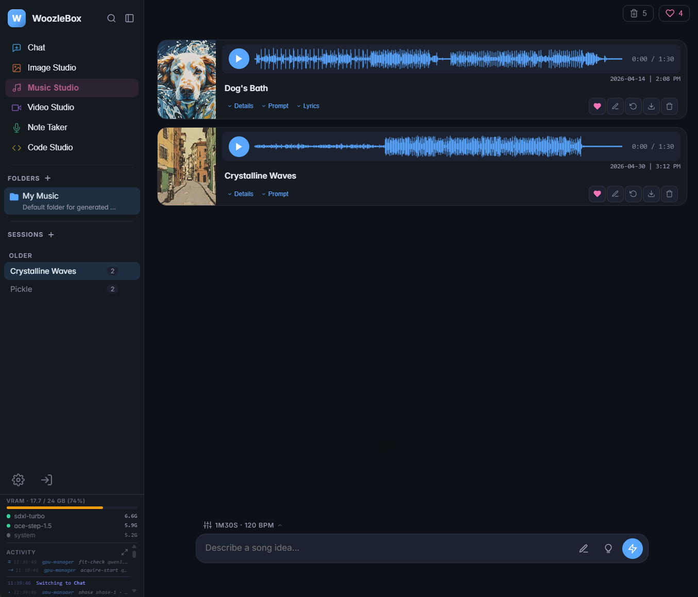
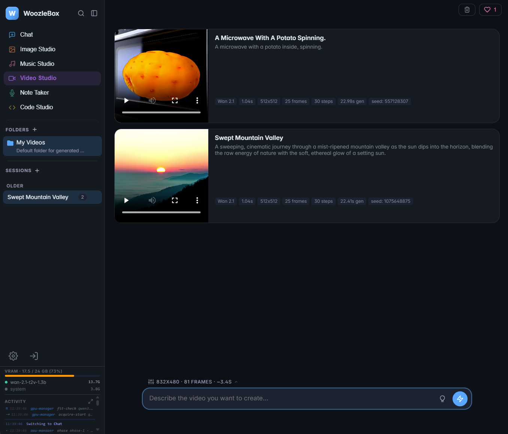
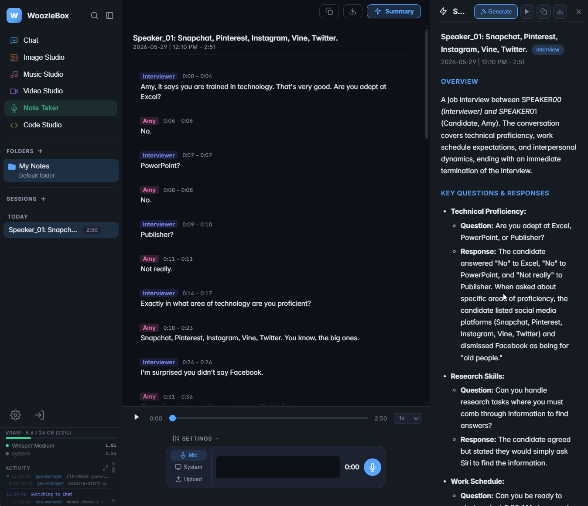
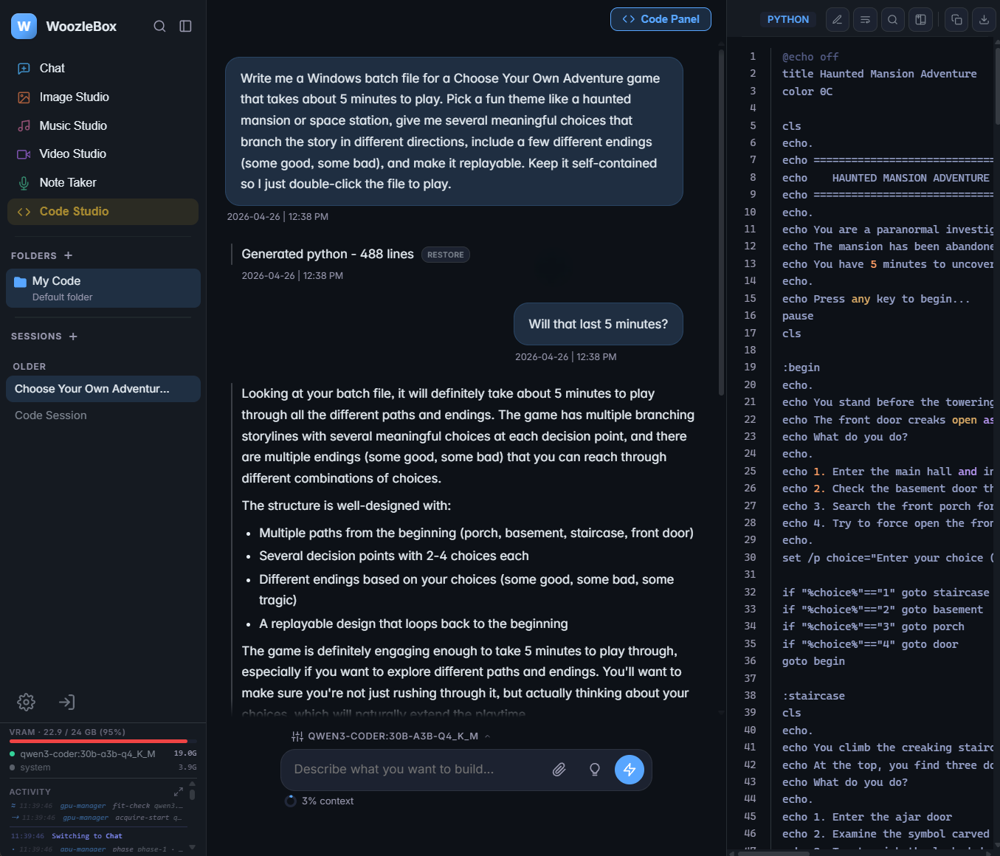
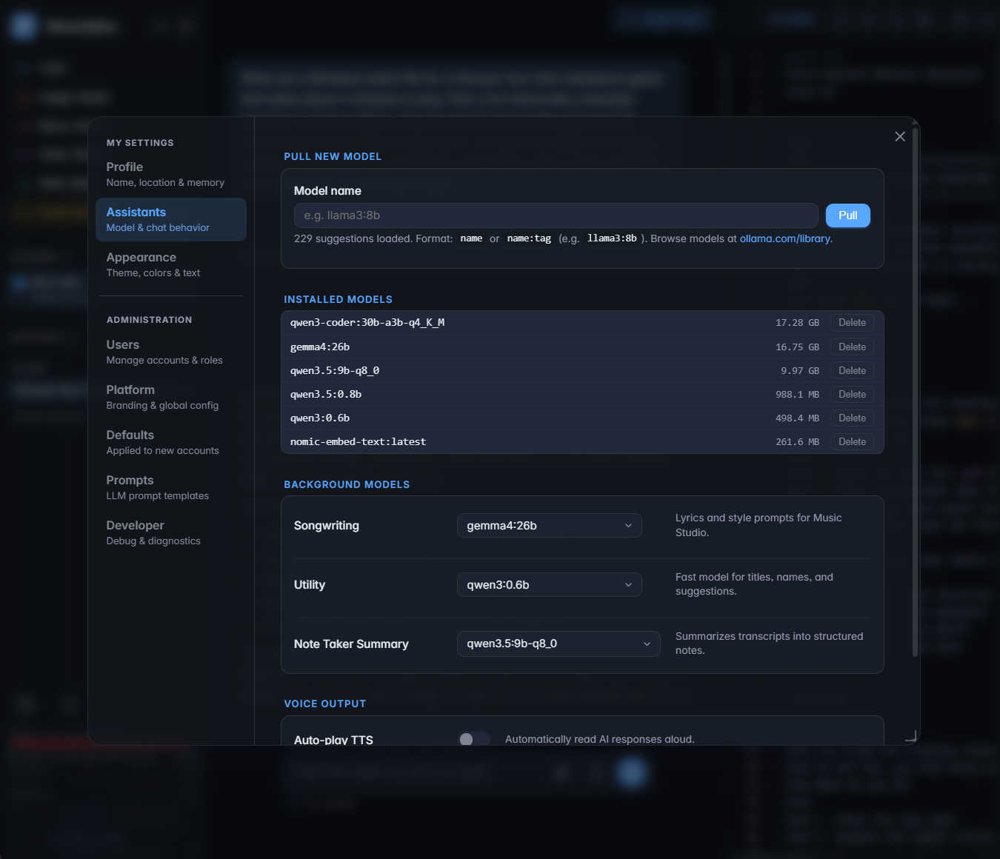

# WoozleBox

A self-hosted AI toolbox that runs entirely on your own hardware. One web UI for local LLM chat with RAG, image/music/video/code generation, meeting transcription, and TTS - no cloud dependencies.

## What's Inside

- **Chat** - Local LLMs via [Ollama](https://ollama.com) with RAG over your own documents, optional web search, per-user memory, conversation folders.
- **Image Studio** - Stable Diffusion 3.5, Playground v2.5, SDXL Turbo, inpainting, Real-ESRGAN upscaling, style presets, folders, trash.
- **Music Studio** - ACE-Step 1.5 text-to-music with AI songwriting and SDXL Turbo cover art.
- **Video Studio** - Wan 2.1 text-to-video.
- **Code Studio** - Code generation, refactor, explain, debug with a pair-programmer editor, plan mode, and sandboxed execution for Python / JS / Bash.
- **Note Taker** - Meeting recording, audio/video upload, whisperX transcription, pyannote speaker diarization, 7 tailored summary types.
- **File Vault** - Upload PDFs, markdown, and text for RAG retrieval in chat.
- **Text-to-Speech** - Expressive GPU TTS via Orpheus (25 voices across 8 languages, inline emotion tags).
- **Multi-user** - User accounts, admin panel, per-user settings, themes, and custom branding.

## Screenshots

Click any screenshot to view it full size.

<p align="center">
  
  
</p>

<p align="center">
  
  
</p>

<p align="center">
  
  
</p>

<p align="center">
  
</p>

## Requirements

- **NVIDIA GPU with 24 GB VRAM.** Tested on RTX 4090. Lower VRAM will not run the default model set - you must pick smaller models in `.env` and expect swap delays between studios.
- **Docker** and **Docker Compose**.
- **NVIDIA Container Toolkit** ([install guide](https://docs.nvidia.com/datacenter/cloud-native/container-toolkit/latest/install-guide.html)).
- **Disk space**: budget ~100 GB for first-run model downloads (LLM, diffusion, music, video, whisperX, Orpheus GGUF).
- **Single-user or small-household use only.** `gpu-manager` serializes GPU access behind one lock - only one generation task runs at a time, additional requests block. This is not suitable for concurrent multi-user workloads.

## Quick Start

```bash
# 1. Verify Docker can see your GPU (should print nvidia-smi output)
docker run --rm --gpus all nvidia/cuda:12.4.0-base-ubuntu22.04 nvidia-smi

# 2. Clone WoozleBox
git clone https://github.com/woozleton/woozlebox.git
cd woozlebox

# 3. Clone the Orpheus FastAPI upstream into ./orpheus (required by tts-api,
#    gitignored so each install brings its own copy)
git clone https://github.com/Lex-au/Orpheus-FastAPI.git orpheus

# 4. Start everything
docker compose up -d
```

Open [http://localhost:8080](http://localhost:8080). On first visit you'll see an **admin setup screen** - create the first account there and you'll be logged in as admin. Subsequent visits show the login screen.

On first run, Ollama will download the default chat model (`qwen3:30b-a3b`, ~18 GB). Image, music, and video models download lazily from HuggingFace the first time you use each studio.

To add more chat models later, admins can pull them directly from **Settings -> Assistants -> Pull New Model** (no shell access needed). The UI suggests names from `ollama.com/library` and shows live download progress.

## Troubleshooting

- **`tts-api` build fails with "./orpheus does not exist".** You skipped step 3 of Quick Start. Run `git clone https://github.com/Lex-au/Orpheus-FastAPI.git orpheus` from the repo root.
- **"could not select device driver with capabilities: [[gpu]]".** NVIDIA Container Toolkit is not installed or not registered with Docker. Follow the install guide linked in Requirements, then restart the Docker daemon.
- **HF 403 on model load, or a red toast in the UI with a HuggingFace link.** The model is gated. Set `HF_TOKEN` in `.env`, visit the linked repo, click "Agree and access", then retry. See HuggingFace Gated Models below.
- **First Ollama pull takes a long time or appears stuck.** The default model is ~18 GB. Track progress with `docker compose logs -f ollama`.
- **Out-of-memory on image, music, or video generation.** Your GPU is under 24 GB. Pick a smaller `LLM_MODEL` in `.env` (so the LLM evicts faster) and switch to a smaller image/music/video model in the studio's settings.
- **Login screen appears on first visit, not setup.** Someone else has already seeded an account. Log in with those credentials, or wipe the `rag_data` volume to start over (`docker compose down && docker volume rm woozlebox_rag_data`).

## Configuration

Create a `.env` file in the project root to override defaults:

```env
# Models
LLM_MODEL=qwen3:30b-a3b
UTILITY_MODEL=qwen3:0.6b
EMBED_MODEL=nomic-embed-text

# Optional API keys
TAVILY_API_KEY=tvly-...
HF_TOKEN=hf_...

# Ports (override any that conflict with other services on your host)
WEB_PORT=8080
RAG_API_PORT=8000
IMAGE_GEN_PORT=8100
MUSIC_GEN_PORT=8200
VIDEO_GEN_PORT=8300
NOTETAKER_API_PORT=8600
GPU_MANAGER_PORT=8400
MEDIA_API_PORT=8500
CODE_RUNNER_PORT=8700

# Tuning
SIMILARITY_THRESHOLD=0.45
```

The TTS voice (25 Orpheus voices across 8 languages) is set per-user in the Settings panel, not via env var.

## HuggingFace Gated Models

Several models are "gated" on HuggingFace - you must accept their license before downloading. Set `HF_TOKEN` in `.env` to a token from [huggingface.co/settings/tokens](https://huggingface.co/settings/tokens), then visit each repo and click "Agree and access":

| Feature | Repo | Required For |
|---------|------|-------------|
| Speaker diarization | [pyannote/speaker-diarization-3.1](https://huggingface.co/pyannote/speaker-diarization-3.1) | Note Taker - identifying who said what |
| Speaker diarization | [pyannote/speaker-diarization-community-1](https://huggingface.co/pyannote/speaker-diarization-community-1) | Note Taker - PLDA scoring (dependency) |
| Speaker diarization | [pyannote/segmentation-3.0](https://huggingface.co/pyannote/segmentation-3.0) | Note Taker - speaker segmentation (dependency) |
| Image generation | [stabilityai/stable-diffusion-3.5-medium](https://huggingface.co/stabilityai/stable-diffusion-3.5-medium) | Image Studio - SD 3.5 model |

Skipping a gated repo disables only the feature that needs it. Transcription still works without diarization - you just won't get per-speaker labels.

## Updating

```bash
cd woozlebox
git pull
cd orpheus && git pull && cd ..    # rarely needed
docker compose up -d --build
```

## Your Data

Back up these locations to preserve user data. Model caches are re-downloadable and don't need backup.

- `./files/` - Vault uploads (bind-mounted, direct filesystem access).
- Docker volume `rag_data` - SQLite DB with users, conversations, memory, studio metadata, settings.
- Docker volume `chroma_data` - RAG vector embeddings (derived from `./files/` but expensive to re-index).
- Docker volume `notetaker_data` - transcripts and recorded/uploaded audio.

## Development

- **Frontend**: edit files in `web/` and refresh the browser. `web/` is bind-mounted into the nginx container, so JS/CSS/HTML changes are live with no rebuild.
- **Backend**: Python source is baked into each service image at build time and there is no auto-reload. After editing, rebuild the affected service:

```bash
docker compose build rag-api
docker compose up -d rag-api
docker compose logs -f rag-api
```

To rebuild everything: `docker compose up -d --build`.

## Architecture

Docker containers on a single machine sharing one GPU. `gpu-manager` serializes VRAM access across all model-loading services so only one model occupies VRAM at a time (except music, which keeps SDXL Turbo alongside ACE-Step for cover art). Switching studios automatically evicts the previous model. See `docs/woozbox-architecture.html` for detailed diagrams and VRAM workflow documentation.

## File Structure

```
woozlebox/
├── docker-compose.yml   # All services, ports, volumes, GPU access
├── web/                 # Static SPA frontend (vanilla JS, nginx-served)
├── rag-api/             # Chat, auth, vault, memory, RAG, TTS proxy
├── media-api/           # Cover art, naming, lyrics, note summaries
├── gpu-manager/         # VRAM orchestration
├── image-api/           # Image generation
├── music-api/           # Music generation
├── video-api/           # Video generation
├── notetaker-api/       # whisperX transcription + pyannote diarization
├── code-runner/         # Sandboxed code execution
├── tts-llm/             # llama.cpp supervisor hosting Orpheus GGUF
└── docs/                # HTML reference documentation
```

The `./orpheus/` directory (Orpheus FastAPI upstream) is cloned separately and gitignored - see Quick Start.

## License

Released under the [MIT License](LICENSE). This covers the WoozleBox source code only - the AI models it downloads (LLMs via Ollama, Stable Diffusion, Wan, ACE-Step, whisperX, pyannote, Orpheus, etc.) each carry their own separate licenses, which you are responsible for reviewing and complying with.
